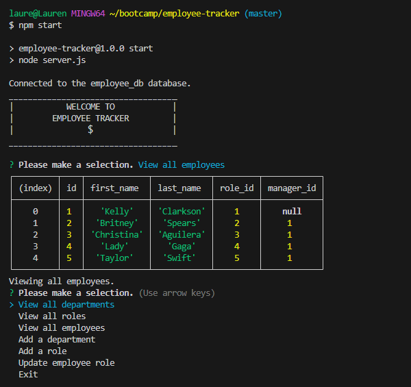

# Employee Tracker

## Activity

- For this activity I created an Employee tracker. This will help employers keep track of the departments, roles, salaries, and employees at their company as well as 

## User Instructions

- To start the application type in npm start into the command line.
- You may view the departments, roles, or employees.
- You may add a department, role, or employee.
- You can update an employees existing role.
- If you would like to exit either choose exit from the prompts or hit ctrl+c(windows) or command+c(mac).

## Screenshot

- Here is a screenshot of the working application.

## Video of Application

- Here is a video of the application running.
[employee-tracker](https://drive.google.com/file/d/1-XnkSYTdnhlVE7LU4srjxDWgSYNpQOEg/view?usp=sharing)